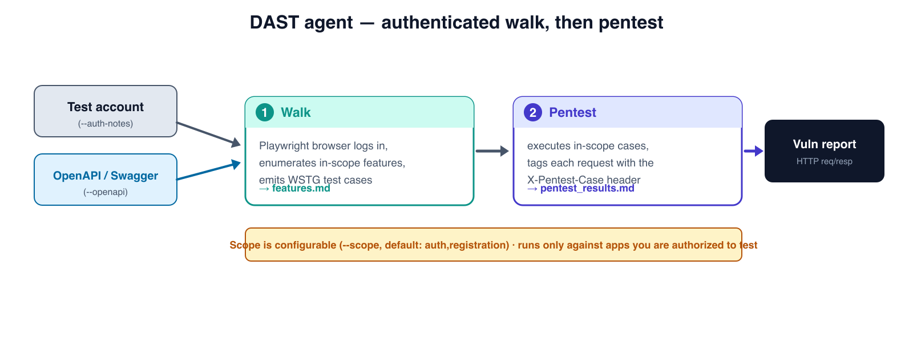

# DAST Agent

**An autonomous, authenticated DAST (Dynamic Application Security Testing) agent.**
Give it a test account and (optionally) an OpenAPI/Swagger spec, and it will log
in, walk your application's authentication and registration flows, generate
WSTG-style security test cases, then execute the in-scope cases against the
running app and produce a vulnerability report with HTTP request/response
evidence.

Built on the [OpenAI Agents SDK](https://github.com/openai/openai-agents-python)
driving a headless [Playwright MCP](https://github.com/microsoft/playwright-mcp)
browser.



> ⚠️ **This tool sends real attack traffic.** Only run it against applications
> you own or are explicitly authorized to test. See
> [Authorization & safety](#️-authorization--safety).

---

## How it works

The pipeline runs in two phases, each an agent with a strict Pydantic output
schema:

1. **Walk** (`WalkFeatures`) -- Logs in with the supplied test account and walks
   the in-scope features in a real browser. It enumerates every input-accepting
   endpoint and emits detailed, WSTG-aligned security test cases per feature.
   - **OpenAPI ingestion:** if you pass `--openapi`, the spec is loaded (local
     path or URL) and condensed into an endpoint inventory (method + path +
     summary) that is fed into the walk agent's context, so it enumerates
     endpoints from the spec instead of relying on crawling alone. Without a
     spec, it falls back to crawl-only.
2. **Pentest** (`WalkVulns`) -- Executes the in-scope test cases against the
   running application, tags **every** request with an `X-Pentest-Case` HTTP
   header (value = the test case name) for traceability, and emits a structured
   vulnerability report with request/response evidence, strict `CWE-<NUM>`
   identifiers, and a severity classification.

Both phases share one centralized headless Chromium browser definition
(`--headless --isolated --browser=chromium --no-sandbox --ignore-https-errors`)
launched via `npx @playwright/mcp@latest`.

Behavioral instructions live as editable Markdown skill files
(`skills/walk/SKILL.md`, `skills/pentest/SKILL.md`) and a security knowledge base
under `references/`. Runtime context (target, scope, credentials, OpenAPI
inventory) is composed on top at run time.

## Requirements

- **Python >= 3.11**
- **Node.js** with `npx` on your PATH (Playwright MCP runs via
  `npx @playwright/mcp@latest`)
- A Chromium browser for Playwright: `npx playwright install chromium`
- Access to an **LLM gateway / API key** exposed over the OpenAI-compatible API
- A **test account** for the target application, and ideally its
  **OpenAPI/Swagger** specification

## Install

```bash
git clone <your-fork-url> dast-agent
cd dast-agent

python -m venv .venv
source .venv/bin/activate

pip install -r requirements.txt

# Install the Chromium browser Playwright MCP drives:
npx playwright install chromium
```

## Configure

Copy the example environment file and fill it in:

```bash
cp .env.example .env
```

```dotenv
OPENAI_API_KEY=your-gateway-key
OPENAI_API_BASE=https://your-gateway.example.com/v1
DAST_MODEL=openai-responses/gpt-5.6-luna
```

`DAST_MODEL` is fully replaceable -- set it to any model your gateway exposes,
or override per run with `--model`. Credentials never live in code; they come
from the environment / `.env` and the `--auth-notes` flags.

## Usage

```bash
python main.py \
  --base-url https://staging.example.com \
  --openapi ./openapi.json \
  --auth-notes "register then log in with any email/password"
```

Common flags:

| Flag | Description |
|------|-------------|
| `--base-url` | **Required.** Base URL of the target application. |
| `--auth-notes` | Inline notes on how to sign up / log in with the test account. |
| `--auth-notes-file` | Read auth notes from a file instead. |
| `--openapi` | Path or URL to an OpenAPI/Swagger spec to ingest. |
| `--scope` | Feature scope to test (default `auth,registration`). |
| `--output-dir` | Where reports are written (default `outputs/`). |
| `--model` | Override the model id for this run. |

Crawl-only run (no spec):

```bash
python main.py --base-url https://staging.example.com \
  --auth-notes "register then log in with any email/password"
```

## Output

Two Markdown files are written to the output directory (default `outputs/`):

- **`features.md`** -- enumerated features and their security test cases.
- **`pentest_results.md`** -- the vulnerability report with evidence.

Truncated example (`pentest_results.md`):

```markdown
# Vulnerability Report

| # | Vulnerability | Severity | CWE ID | Description | Observation |
|---|---------------|----------|--------|-------------|-------------|
| 1 | Username enumeration on login | Medium | CWE-203 | Login reveals... | Distinct 404... |

## Evidence Details

### 1. Username enumeration on login
#### Evidence 1: Invalid vs valid username
...
**HTTP Request:**
`​``http
POST /api/login HTTP/1.1
Host: staging.example.com
X-Pentest-Case: Username enumeration on login
...
`​``
```

## Customize

Skills are files, not buried strings -- edit them without touching Python:

- `skills/walk/SKILL.md` and `skills/pentest/SKILL.md` -- the agent behavior for
  each phase (valid YAML frontmatter + Markdown body). Loaded via
  `skills.load_skill()`, which guards against path escapes.
- `references/web-test-cases.md` -- the WSTG-aligned catalog the walk agent
  draws on when generating test cases.
- `references/authorization-and-scope.md` -- rules of engagement.
- `references/evidence-format.md` -- finding/evidence structure, CWE format, and
  severity rubric.

The Pydantic output schemas live in `schemas.py`; the browser, model, and
settings factories live in `config.py`.

## ⚠️ Authorization & safety

**This tool generates real attack traffic.** Misuse can be illegal and harmful.

- Run it **only** against applications you own or are **explicitly authorized**
  (in writing) to test.
- Agree **scope** and acceptable request **rate** up front; keep runs within the
  configured `--scope`.
- **Non-destructive** testing only -- no data deletion, no exfiltration of real
  user data, no account lockout, no availability impact.
- Every test-case request carries the **`X-Pentest-Case`** header so defenders
  can identify and attribute the traffic.

Read [`references/authorization-and-scope.md`](references/authorization-and-scope.md)
and [`SECURITY.md`](SECURITY.md) before your first run.

## Limitations

- Findings are produced by an LLM-driven agent and require **human validation**;
  expect both false positives and missed issues.
- Default scope is **authentication and registration**. Broader scopes are
  configurable via `--scope`, but the bundled test-case catalog is deepest for
  auth/registration.
- Requires a working **test account**; it is not designed to defeat MFA,
  CAPTCHAs, or third-party/social login (which it deliberately avoids).
- Non-determinism: two runs may differ. Treat reports as leads, not proof.
- YAML OpenAPI specs require `PyYAML` to be installed; JSON specs work out of the
  box.

## License

[MIT](LICENSE)
